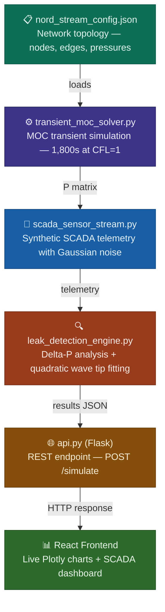

# Digital Twin — Pipeline Leak Detection Engine

A network-agnostic pipeline leak detection system built on the Method of Characteristics (MOC) transient flow solver. The engine simulates a high-pressure gas transmission pipeline, injects a synthetic rupture event at any point in the network, and mathematically triangulates the exact rupture location using pressure wave analysis and quadratic curve fitting on SCADA telemetry data.

Validated against a Nord Stream 1 topology approximation — 1,222 km, 100 nodes, operating at 220 bar inlet pressure.

---

## What This Does

When a pipeline ruptures, it sends pressure waves propagating outward from the breach at the speed of sound in the fluid. Upstream sensors see a drop wave arriving from the right. Downstream sensors see the same drop arriving from the left. The point where those two wave fronts originated is the leak.

This engine simulates that entire sequence from first principles:

1. A MOC transient solver models 1,800 seconds of pipeline physics at millisecond resolution
2. A synthetic SCADA network samples the pressure field at 10 sensor stations with realistic Gaussian noise
3. The detection algorithm computes the delta-P signature at each sensor — the pressure drop relative to the pre-rupture baseline
4. A quadratic curve fit on the delta-P profile finds the peak, which mathematically corresponds to the rupture location
5. A Flask API serves the results to a React frontend with live Plotly charts

---

## Pipeline Overview



---

## The Physics

### Method of Characteristics (MOC)

The governing equations for transient flow in a pipeline are the continuity and momentum equations:

**Continuity:**
```
∂P/∂t + (ρc²/A) · ∂M/∂x = 0
```

**Momentum:**
```
ρ/A · ∂M/∂t + ∂P/∂x + R·M·|M| = 0
```

Where:
- `P` = pressure (Pa)
- `M` = mass flow rate (kg/s)
- `ρ` = fluid density (kg/m³)
- `c` = wave speed (m/s)
- `A` = pipe cross-sectional area (m²)
- `R` = friction resistance coefficient

MOC transforms these into ordinary differential equations along characteristic lines in the space-time domain. For a pipeline, two characteristic lines exist — a forward-propagating C+ and a backward-propagating C−:

**C+ characteristic (travels forward at +c):**
```
C⁺ = P[t, x-1] + M[t, x-1] · Z
```

**C− characteristic (travels backward at −c):**
```
C⁻ = P[t, x+1] − M[t, x+1] · Z
```

Where `Z = c/A` is the pipeline's **characteristic impedance** — the ratio of wave speed to cross-sectional area. High impedance means small flow changes produce large pressure swings.

**Solving for the new state at each internal node:**
```
P[t+1, x] = (C⁺ + C⁻) / 2  −  (leak[x] · Z / 2)
M[t+1, x] = (C⁺ − C⁻) / (2 · (Z + R_friction))  −  (leak[x] / 2)
```

The leak term subtracts mass from node `x` at each timestep after the rupture activates. This creates the pressure drop signature the detection algorithm reads.

### Time Step — CFL Condition

The time step is set by the Courant-Friedrichs-Lewy condition at unity:

```
dt = dx / c
```

At CFL = 1, the characteristic lines connect grid points exactly. The MOC equations are numerically exact at this value. Any other CFL requires interpolation between nodes, introducing numerical diffusion that would smear the pressure wave and degrade detection accuracy.

Note: By using the Method of Characteristics (MOC) with a Courant number (CFL) of 1.0, this solver achieves numerical exactness. We avoid artificial "numerical diffusion" that would otherwise smear the pressure wave across the grid, allowing for the sub-kilometer triangulation precision seen in the anomaly reports.
### Friction Model

The friction resistance coefficient uses Darcy-Weisbach:

```
R_coef = (8 · f · dx · ρ) / (π² · D⁵)
```

Where `f` is the Darcy friction factor. An implicit friction treatment averages adjacent node values to prevent numerical oscillations at high flow rates:

```
implicit_friction = R_coef · (|M[t, x-1]| + |M[t, x+1]|) / 2
```

### Characteristic Impedance

```
Z = c / A
```

Physically: the pressure change per unit mass flow rate change. A pipe with high Z (small diameter or high wave speed) will show large pressure swings from small leaks — this is why small-diameter pipes are easier to monitor than large ones.

### Boundary Conditions

**Inlet (left boundary — supply station):**
```
P[t+1, 0] = P_start  (fixed pressure)
M[t+1, 0] = (P_start − C⁻[1]) / (Z + R_coef · |M[t, 1]|)
```

**Outlet (right boundary — delivery station):**
```
P[t+1, -1] = P_end  (fixed pressure)
M[t+1, -1] = (C⁺[-2] − P_end) / (Z + R_coef · |M[t, -2]|)
```

---

## The Detection Algorithm

### Delta-P Signal

Instead of working with absolute pressures (which are dominated by the nominal 220→100 bar gradient), the engine computes the **pressure drop relative to pre-rupture baseline** at each sensor:

```
ΔP[sensor] = mean(signal[first 15 samples]) − mean(signal[last 300 samples])
```

The first 15 samples are from before the rupture activates (t < 50s). The last 300 samples are from after the transient wave has settled. This isolates only the rupture-induced pressure change, removing the nominal gradient entirely.

The delta-P profile peaks at the rupture location and decays outward in both directions.

### Quadratic Wave-Tip Fitting

The detection algorithm finds the peak of the delta-P profile and fits a quadratic through the three sensors nearest to the peak:

```
ΔP(x) ≈ a·x² + b·x + c
```

The rupture location is the vertex of this parabola:

```
x_leak = −b / (2a)
```

This is physically justified because near its maximum, any smooth single-peaked function is well approximated by a second-order Taylor expansion. The closed-form vertex formula gives a stable, noise-tolerant estimate without requiring iterative solving.

---

## Network Configuration

The topology is loaded from `nord_stream_config.json`:

| Parameter | Value |
|---|---|
| Pipeline length | 1,222 km |
| Number of nodes | 100 |
| Node spacing (dx) | ~12.22 km |
| Inlet pressure | 220 bar |
| Delivery pressure | 100 bar |
| Pipe diameter | 1.22 m |
| Friction factor | 0.01 |
| Wave speed | 340 m/s |
| Time step (dt) | ~2.94 s |
| Total simulation time | 1,800 s |

---

## Full Setup Guide

Follow these steps in order. Do not skip ahead — the Flask backend must be running before the frontend will work.

### System Requirements

- Python 3.8 or higher
- Node.js 18 or higher and npm
- A free Supabase account (for cloud database logging)

Check your versions before starting:

```bash
python --version
node --version
npm --version
```

---

### Step 1 — Clone the Repository

```bash
git clone https://github.com/Praixx/Digital-Twin---Pipeline-Leak-detection.git
cd Digital-Twin---Pipeline-Leak-detection
```

---

### Step 2 — Create Your Supabase Project

The simulation logs pressure data to a Supabase database in real time. You need a free Supabase account to use this feature.

1. Go to [supabase.com](https://supabase.com) and create a free account
2. Click **New Project** and give it a name (e.g. `pipeline-twin`)
3. Once the project is created, go to **Project Settings → API**
4. Copy two values: your **Project URL** and your **anon public key**

---

### Step 3 — Create the `.env` File

In the **root of the repository** (the same folder as `api.py`), create a file called `.env`:

```bash
touch .env
```

Open it and paste in the following, replacing the placeholder values with your actual Supabase credentials from Step 2:

```
SUPABASE_URL=https://your-project-id.supabase.co
SUPABASE_KEY=your-anon-public-key-here
```

The file should sit here:

```
Digital-Twin---Pipeline-Leak-detection/
├── .env                  ← create this here
├── api.py
├── leak_detection_engine.py
├── scada_sensor_stream.py
├── transient_moc_solver.py
├── db_client.py
├── nord_stream_config.json
└── frontend/
```


---

### Step 4 — Set Up the Python Backend

Install all Python dependencies:

```bash
pip install numpy flask flask-cors supabase python-dotenv
```

Full dependency list:

| Package | Purpose |
|---|---|
| `numpy` | Array operations — P matrix, M matrix, noise generation |
| `flask` | REST API server |
| `flask-cors` | Cross-origin request headers for the React frontend |
| `supabase` | Official Supabase Python client — logs simulation data |
| `python-dotenv` | Loads your `.env` file so `db_client.py` can read the keys |


---

### Step 5 — Start the Flask Backend

**This must be running before you start the frontend.**

```bash
python3 api.py
```

You should see:

```
 * Running on http://127.0.0.1:5001
 * Debug mode: on
```

Leave this terminal window open. The backend runs at `http://localhost:5001`.

---

### Step 6 — Set Up the Frontend

Open a **second terminal window** (keep the first one running the Flask server).

Navigate into the frontend folder:

```bash
cd digital-twin--dashboard
```

Install all Node.js dependencies including Tailwind CSS:

```bash
npm install
```

This installs everything in `package.json`, including:

| Package | Purpose |
|---|---|
| `react` | UI framework |
| `react-plotly.js` + `plotly.js` | Live pressure wave charts and SCADA dashboard |
| `tailwindcss` | Utility CSS framework for the dashboard layout |
| `postcss` + `autoprefixer` | Required by Tailwind to process CSS |

---

### Step 7 — Start the Frontend

Still in the `frontend/` directory, run:

```bash
npm run dev
```

The dashboard will open automatically at `http://localhost:5173`.

If it doesn't open automatically, navigate to `http://localhost:5173` in your browser.

---

### Step 8 — Run Your First Simulation

In the dashboard:

1. Use the **Rupture Location** slider to pick a point along the pipeline (e.g. 611 km)
2. Set the **Leak Severity** (e.g. 150 kg/s)
3. Click **Simulate**

The MOC engine will run the full 1,800-second transient simulation, the SCADA layer will generate sensor telemetry, and the detection algorithm will triangulate the rupture location. Results appear on the Plotly chart with the detected location, actual location, and error margin in km.

The full simulation takes roughly 15-30 seconds depending on your hardware.

---

### Testing via the API directly

You can also trigger a simulation from the terminal without the frontend:

```bash
curl -X POST http://localhost:5001/simulate \
  -H "Content-Type: application/json" \
  -d '{"targetNode": 611, "severity": 150}'
```

Expected response:

```json
{
  "telemetry": {
    "actual_km": 611.0,
    "calc_km": 608.34,
    "error_margin": 2.66,
    "max_drop": 14.22,
    "inlet_supply": 220.0,
    "delivery_station": 98.71,
    "status": "SECURE"
  },
  "plot_data": {
    "scada_x": [100, 200, 300, 400, 500, 700, 800, 900, 1000, 1100],
    "scada_y": ["..."],
    "wave_x": ["..."],
    "wave_y": ["..."],
    "curve_x": ["..."],
    "curve_y": ["..."]
  }
}
```

---

### Troubleshooting

**Frontend shows a blank page or network error:**
The Flask backend is not running. Go back to your first terminal and run `python3 api.py` before starting the frontend.

**`ModuleNotFoundError: No module named 'supabase'`:**
Run `pip3 install supabase python-dotenv` and try again.

**`SUPABASE_URL` or `SUPABASE_KEY` not found error:**
Your `.env` file is either missing, in the wrong folder, or has a typo in the variable names. Check it is in the root of the repo (same folder as `api.py`) and contains both `SUPABASE_URL` and `SUPABASE_KEY`.

**Tailwind styles not loading / dashboard looks unstyled:**
Run `npm install` again inside the `digital-twin--dashboard` folder. If the issue persists, delete the `node_modules` folder and run `npm install` fresh.

**Port 5001 already in use:**
Another process is using that port. Either stop it or change the port in `api.py` (`app.run(port=5001)`) and update the API URL in the frontend accordingly.

---

## Repository Structure

```
Digital-Twin---Pipeline-Leak-detection/
├── api.py                      Flask REST API — POST /simulate endpoint
├── leak_detection_engine.py    Delta-P computation and quadratic wave-tip fitting
├── scada_sensor_stream.py      Synthetic SCADA telemetry with Gaussian noise
├── transient_moc_solver.py     Core MOC physics engine — 1,800s transient simulation
├── db_client.py                Supabase client — logs simulation state to cloud DB
├── nord_stream_config.json     Network topology — Nord Stream 1 approximation
├── requirements.txt            Python dependencies
├── .env                        Your Supabase credentials (create this, do not commit)
└── digital-twin--dashboard/
    ├── src/
    │   ├── App.js              Main dashboard component
    │   └── ...
    ├── package.json            Node.js dependencies including Tailwind
    ├── tailwind.config.js      Tailwind CSS configuration
    └── postcss.config.js       PostCSS configuration required by Tailwind
```

---

## Known Limitations & Planned Upgrades

This is a portfolio demonstration of the methodology. The following simplifications are documented:

**Current simplifications:**
- Constant wave speed (c = 340 m/s). Real gas pipelines have wave speeds varying 15-25% with local pressure and temperature
- Fixed Darcy friction factor. Production systems use Colebrook-White with Reynolds-number-dependent friction
- 10 sensors across 1,222 km (one per ~120 km). Real SCADA systems have sensors every 5-20 km
- Single-phase flow. Real pipelines carry gas with dissolved liquids requiring multiphase treatment

**Planned upgrades:**
- [ ] Variable wave speed via Peng-Robinson equation of state at each node
- [ ] Colebrook-White implicit friction: `1/√f = −2·log(ε/3.7D + 2.51/Re√f)`
- [ ] Allow for uploading the Json file for any pipeline configuration
- [ ] Include a map, so that it can plot the pipes on the mad to show how it goes
- [ ] Upgrade it to be able to handle pipelines with branch geometry
- [ ] Denser synthetic sensor coverage (20 km spacing)
- [ ] Temperature coupling — energy equation alongside continuity and momentum


Pull requests are welcome. If you're working on any of the above, open an issue first.

---

· [LinkedIn](https://linkedin.com/in/praise-god-olaoye)

---
